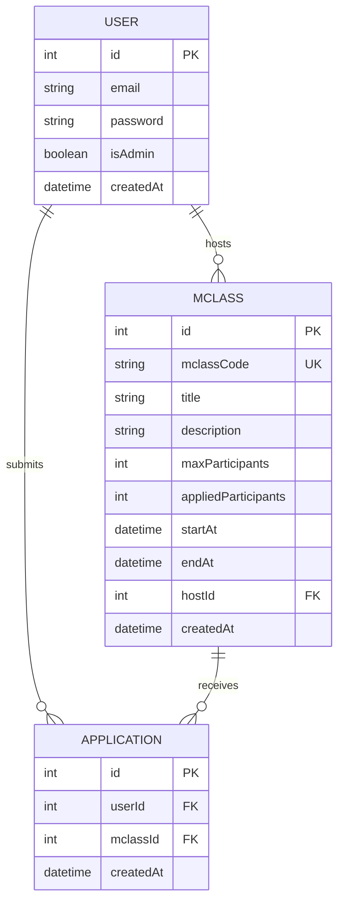
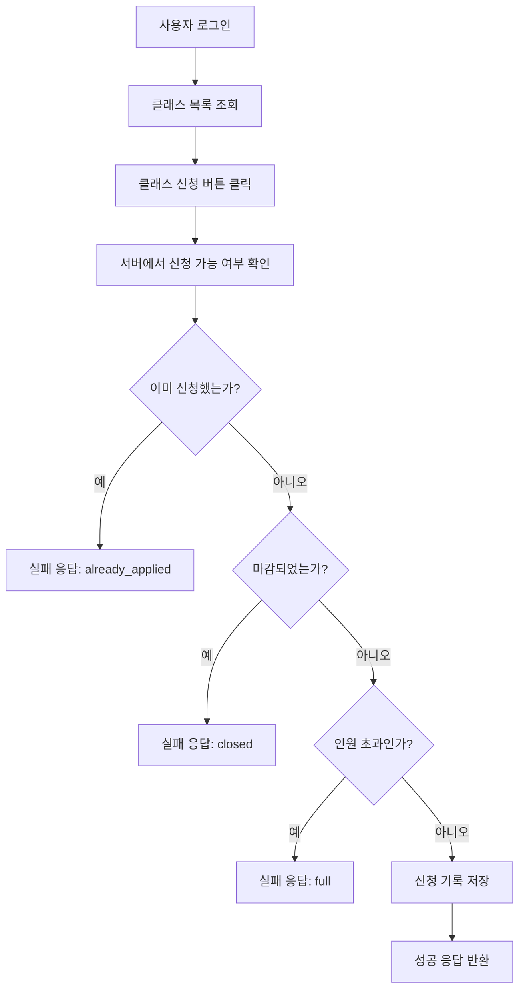
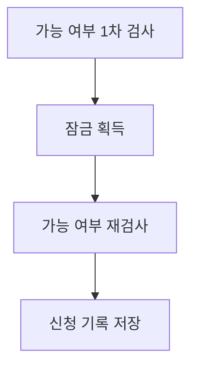

## 프로젝트 실행 방법

1. Docker로 DB 세팅 (MySQL + 마이그레이션)

```bash
docker compose up -d --build mysql
docker compose up --build migrator
```

- 호스트 포트: 3308 → 컨테이너 MySQL 3306
- migrator로 테이블과 인덱스 세팅
- 상세 내용 compose.yaml 파일 참조

2. 의존성 설치 및 서버 실행

```bash
npm i
npm run dev
```

## 테스트 방법

1. 테스트 데이터 주입

**테스트를 진행하기 전 아래 스크립트로 테스트 데이터를 주입해야 합니다.**
누락 시 테스트 스크립트에 오류가 발생할 수 있습니다.

```bash
npm run test:setup
```

2. 테스트 실행

```bash
# 전체 테스트 ( e2e & concurrency )
npm run test:all

# 또는 개별 실행
npm run test:e2e
npm run test:concurrency
```

### 참고

만약 setup.test.ts 스크립트를 다시 실행시켜야 한다면 migrator로 디비를 원상복구하고 다시 실행하는 걸 권합니다.

```bash
docker compose run --rm --build migrator sh -c 'bash /migrator/migrate.sh "$DB_HOST" "$DB_PORT" "$DB_NAME" "$DB_USERNAME" /run/secrets/mysql_user_password down'
docker compose up --build migrator
npm run test:setup
```

## API 명세

`npm run dev` 실행 후 [스웨거](http://localhost:3000/api-docs)에서 확인 가능합니다.

링크: http://localhost:3000/api-docs

## ERD

### 참고:

ERD, 기능 흐름도는 mermaid 문법으로 작성했습니다.
Github 외 다른 환경에서 확인 시 Mermaid Preview 플러그인 설치가 필요할 수 있습니다.



## 기능흐름도



### 참고: 동시성 안전(락 후 재검사)

- 실제 구현(`Application.service.apply`)에서는 지원 가능 여부를 두 번 검사합니다. 락을 획득하기 전 한 번, 획득 후 한 번 더 재검사합니다.
- 잠금 상태 전 검사는 락을 최소화 하기 위해서 입니다.
- 잠금 상태 후 검사는 동시성을 제어하고 OverApply를 방지하기 위해서 입니다.



## 설계 의도 및 트러블 슈팅 정리

- 아키텍처/스택: Express + TypeORM + MySQL, Swagger(UI) 문서, JWT 인증, Docker Compose(MySQL + Migrator)
- 데이터 모델링: `User` ↔ `Application` ↔ `MClass` 1:N 연결. `MClass.appliedParticipants`으로 빠른 full Confict 처리 가능
- 동시성 제어: 신청 API는 1차 검사 → 락 획득 → 재검사 → 저장. 락 최소화 및 과다 신청(Over-apply) 방지. 동시성 테스트로 검증 가능
- 특정 유저만 M클래스 상세 조회: admin, host, 지원한 유저만 조회 가능
- 페이지네이션/정렬: `pageNo`, `pageSize(기본 20)` 쿼리 파라미터로 과다 선택 방지. 정렬 기준이 명확하지 않아 `createdAt DESC` 사용.
- 마이그레이션: `migrator` 컨테이너로 디비 컨테이너 마이그레이션 up/down. 필요 시 down→up으로 디비 초기화
- 인덱스: `application(userId)`, `application(mclassId)`, `mclass(startAt, endAt)` 등 조회 경로 최적화. `mclass(createdAt)`에 인덱스 추가해 정렬 시 filesort 사용 방지. => `ORDER BY createdAt DESC`
- 인증/권한: `authenticateJWT`로 인증, `requireAdmin`으로 관리자 전용 API 보호. JWT 만료(1d)
- 에러 처리: 전역 에러 미들웨어 표준화. 로그인/권한/중복 신청/마감/정원 초과 등 도메인 오류를 명확한 상태코드와 메시지로 응답
- 테스트 전략: E2E + 동시성 테스트. 대량 데이터 준비는 `npm run test:setup`. DB/migrator 선행 후 테스트 실행
- 문서화: Swagger에 API 명세 작성 `http://localhost:3000/api-docs`
- 비밀키 보호: Ansible encrypt를 사용해 비밀키 암호화 후 공유 가능. 단 과제 제출용으로 .env 파일 첨부

## Comment

- 리뷰 감사합니다. 문의사항이 있다면 편하게 연락 주시기 바랍니다.
